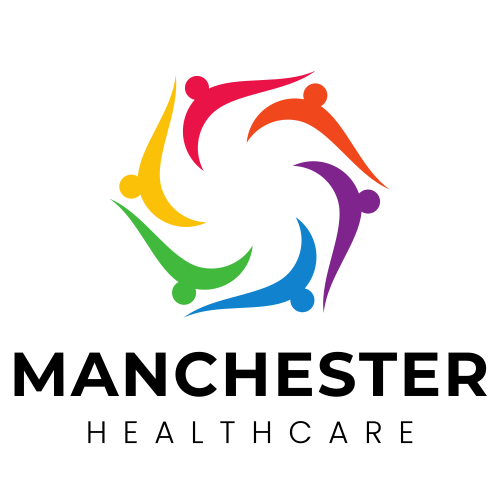

<h1 align="center" id="global-solution">
🩸 Global Solution
</h1>

<picture>
  <source media="(prefers-color-scheme: dark)" srcset="./Assets/Logo/DarkLogo.svg">
  
</picture>

> Repositório utilizado para a entrega da 2ª Global Solution

  
<h3><strong>Índice</strong></h3>

  <ol>
    <li><a href="#sobre">Sobre o Challenge</a></li>
    <li><a href="#autores">Integrantes</a></li>
  </ol>

<h2 name="sobre">📖 Sobre a Global Solution</h2>

| _Global Solution 2_ |                                       |
| ------------------- | ------------------------------------- |
| _Curso_             | Análise e Desenvolvimento de Sistemas |
| _Turma_             | 1TDSS                                 |
| _Período_           | 2º                                    |
| _Tema_              | [PDF](./GlobalSolution.pdf)           |

<!-- Resumo -->
<h2 name="resumo">📝 Resumo</h2>

O Manchester HealthCare (MHC) surgiu da ideia de implantar o Protocolo Manchester, o mais famoso sistema de triagem e classificação de risco dos pacientes do mundo, nos hospitais para garantir melhora e rapidez em emergências e traumas. O software desenvolvido visa a praticidade e agilidade para determinar a gravidade e definir quais pacientes precisam de atendimento prioritário.

A classificação de prioridade se baseia em 52 fluxogramas presentes no protocolo, cada um sendo sobre o sinal primário (queixa principal do paciente) e seus sintomas específicos que podem vir ou não a aparecer, de acordo com a gravidade. A partir disso, podem ser divididos em 5 grupos diferentes embasados na complexidade de seus casos, recebendo uma pulseira da cor correspondente:

- Emergencial: Cor vermelha
  A pulseira vermelha é dada aos pacientes que têm risco de morte ou estão em condições de gravidade extrema e que precisam de atendimento imediato. É possível citar como exemplos os casos de crises convulsivas, paradas cardiorrespiratórias, hemorragias severas, queimaduras em mais de 25% do corpo, entre outros.

- Muito urgente: Cor laranja
  A pulseira laranja serve para indicar pacientes também em casos urgentes, porém, em um nível mais moderado que a anterior. Sendo assim, o tempo de espera nesses casos é de, no máximo, 10 minutos. São exemplos desse caso dores muito severas, cefaleia de rápida progressão.

- Urgente: Cor amarela
  Já as pulseiras amarelas servem para indicar que o paciente pode correr risco, mas não imediato. Dessa forma, esses pacientes podem esperar até 1 hora para serem atendidos. Entre os casos mais comuns estão vômitos intensos, desmaios, crises de pânico e sinais vitais alterados.

- Pouco urgente: Cor verde
  As pulseiras verdes servem para indicar pacientes em casos pouco urgente e que podem esperar até 2 horas. Viroses, tonturas, resfriados e dores leves se encaixam nesse nível de gravidade.

- Não urgente: Cor azul
  Por fim, as pulseiras azuis são para identificar os quadros em que não há urgência para o atendimento, onde os pacientes podem esperar até 4 horas ou serem encaminhados para a unidade básica de saúde.

<h2 name="requisitos">📋 Requisitos</h2>

<h3>AI E CHATBOT</h3>

- [x] Entrega 1: Fazer uma análise estatística exploratória da base de dados, resumindo as variáveis e o contexto geral da base selecionada (20 pontos);

- [x] Entrega 2: Construir 5 gráficos distintos utilizando as variáveis da base. Vocês podem fazer gráficos selecionando parte dos dados de acordo com filtros que julgarem pertinentes. Atenção:
- [x] Entrega 3: Construir 2 modelos preditivos distintos, selecionando-os entre os tipos vistos em sala: regressão, classificação ou clusterização. A avaliação partirá dos seguintes critérios:
- [x] Entrega 4: Adaptar o script do servidor Flask fornecido para que os modelos de IA criados na entrega 3 possam ser integrados a sua aplicação;

<h3>BUILDING RELATIONAL DATABASE</h3>

- [ ] Modelo de Dados Relacional, mais descritivo até 20 pontos;

- [x] SCRIPT DDL até (20 pontos);
- [x] SCRIPT DML: (20 pontos);
- [x] SCRIPT DQL até (40 pontos).

<h3>COMPUTATIONAL THINKING USING PYTHON</h3>

- [x] Código fonte (arquivos .py) do sistema desenvolvido conforme os requisitos listados previamente (60 pontos).

- [ ] Vídeo explicando a solução e demonstrando o software funcionando, com duração máxima de 5 minutos. O vídeo deve ser disponibilizado no Youtube (ou equivalente) (20 pontos)
- [x] Documento com a especificação da solução proposta:
  - [x] O arquivo deve ter uma capa com o nome da solução, nome e RM dos integrantes, turma de cada integrante e um link para o vídeo disponibilizado (não esqueça de deixar o vídeo acessível) (10 pontos).

<h3>DOMAIN DRIVEN DESIGN</h3>

- [ ] Documentação (Total 30 Pontos)

  - [ ] Especificação do projeto (Documento PDF) - (10 pontos):
  - [ ] Diagrama de Classes (10 pontos)
  - [ ] Protótipos de tela e DER (10 pontos)

- [x] Projeto Java (Total 70 Pontos)
  - [x] Camada beans, suas classes devem conter métodos construtores, getters e setters (5 pontos);
  - [x] Camada BO, com suas classes podendo conter regras de negócio (a complexidade será um critério da avaliação) (10 pontos);
  - [x] Camada Resource, contendo CorsFilter e classe resource, com GET, POST, PUT e DELETE (15 pontos);
  - [x] Camada de conexão, com classe para conexão com banco de dados (padrões DAO / Factory / Singleton) (10 pontos);
  - [x] Separação de responsabilidade em camadas (Arquitetura MVC) (5 pontos);
  - [x] Uso adequado dos verbose códigos de status do HTTP (5 pontos);
  - [x] Boas práticas na escrita do código (organização) (10 pontos);
  - [x] Camada de Exceções, classe com tratamento correto das Exceptions (5 pontos).

<h3>SOFTWARE DESIGN E TOTAL EXPERIENCE</h3>

- [ ] Diagrama de Caso de Uso completa da solução (15 pontos);

- [ ] Diagrama de Atividades completa da solução (15 pontos);
- [ ] Diagrama de Sequência completa da solução (15 pontos);
- [ ] Descrição detalhada do caso de uso, com cenários principal, alternativos e de exceção (15 pontos);
- [ ] Vídeo pitch de no máximo 3 minutos
- [ ] Plano de negócio com:
  - [ ] Sumário de proposta de negócio (15 pontos);
  - [ ] Considerando que a sua Startup terá gastos de investimento de R$100.000,00 reais e ganho previsto de R$220.000,00, qual é o ROI? (10 pontos);
  - [ ] Considerando que na operação da sua startup você gaste R$ 10.000 de custo mensal, onde R$ 3.000 são custos variáveis e R$ 7.000 são fixos. Se considerar que receita bruta média de vendas de serviços de R$ 5.000 por mês, qual o ponto de equilíbrio? (10 pontos);
  - [ ] Uma vez que sua startup para prover serviços de suporte para a HapVida, a qual será seu primeira cliente, defina indicadores dos níveis de SLA do atendimento (5 pontos).

<h3>RESPONSIVE WEB DEVELOPMENT</h3>

- [ ] Padronização dos endpoints(API)

  - [ ] As telas criadas deverão apresentar um padrão de apresentação (CSS) (20 pontos);
  - [ ] A navegação a acessibilidade e a usabilidade serão levadas em consideração para a correção da GS (15 pontos);
- [ ] Componentização dos elementos (TOTAL 15 pontos)
- [ ] Formulário de cadastro/atualização:
  - [ ] Os dados persistidos devem permanecer na base de dados, mesmo depois da aplicação encerrada, ou seja, se fecharmos a aplicação e/ou o navegador, quando retornarmos os dados deverão ser exibidos novamente, com as alterações que foram realizadas e etc (10 pontos);
  - [ ] Os dados devem ser persistidos em base de dados, além disso, a fim de evitar o tráfego desnecessário de dados pela rede, utilize estratégias que minimize esse processo, tais como: LOCALSTORAGE e/ou as APIs locais do NEXT.js que gerenciam as entradas de dados na aplicação e criam seu próprios caches. No caso de login/validação utilize SESSIONSTORAGE (10 pontos);
  - [ ] Gerar páginas de erro e ou aviso de acordo com o Status Code HTTP, por conta dos retornos gerados na utilização dos verbos HTTP: get, put, delete, post (15 pontos);
  - [ ] Os dados exibidos na tela e os dados que forem gravados na base dados devem ser feitos no formato JSON (15 pontos).

<h2 name="autores">✍️ Integrantes</h2>
<table>
  <tr>
    <td align="center">
      <a href="https://github.com/Asteriuz">
         
        
          <strong>Augusto Barcelos Barros</strong>
        
      </a>
    </td>
    <td align="center">
      <a href="https://github.com/gribl88">
         
        
          <strong>Gabriel Gribl de Carvalho</strong>
        
      </a>
    </td>
    <td align="center">
      <a href="https://github.com/GabrielSouzaQ">
         
        
          <strong>Gabriel Souza de Queiroz</strong>
        
      </a>
    </td>
    <td align="center">
      <a href="https://github.com/GabsBecca">
         
        
          <strong>Gabriela Zanotto Alves Rodrigues</strong>
        
      </a>
  </tr>
</table>

[⬆ Voltar ao topo](#global-solution) 
